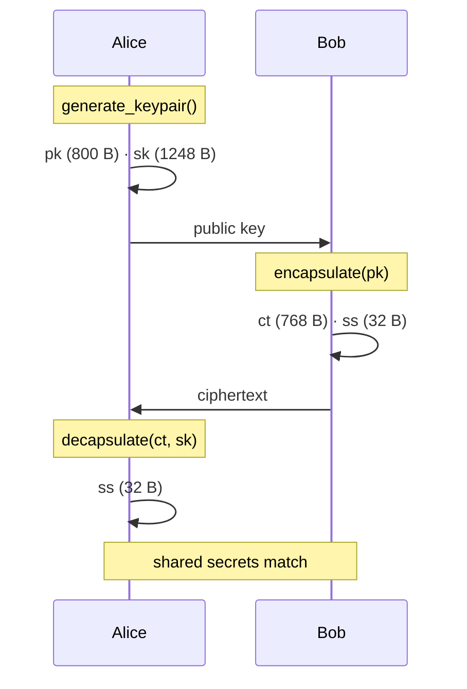

<p align="center">
  <a href="https://bajpailabs.com"></a>
</p>

<p align="center">
  
  
  
  
</p>

<h1 align="center">VORTEX-256</h1>

<p align="center">
  <strong>A new lattice KEM built on Rotational Module Learning With Errors</strong><br/>
  <sub>Same footprint as Kyber-512 · Entirely different mathematics · Standalone library</sub><br/>
  <sub>A <a href="https://bajpailabs.com">Bajpai Labs</a> project · <a href="https://postquantumlabs.in/library/vortex-pqc">postquantumlabs.in/library/vortex-pqc</a></sub>
</p>

<p align="center">
  <a href="https://github.com/bajpai-labs/vortex-pqc/actions/workflows/ci.yml"></a>
  <a href="https://pypi.org/project/vortex-pqc/"></a>
  <a href="https://postquantumlabs.in/library/vortex-pqc"></a>
  <a href="https://postquantumlabs.in/docs/vortex-pqc"></a>
</p>

<br/>

```
                              ╭──────────────────────────────────────╮
                              │                                      │
         ρ  ──▶  a₀ ──σ──▶  a₁ ──σ──▶  a₂ ──σ──▶  …               │
                              │         Frobenius orbit              │
                              │         of a single ring element     │
                              ╰──────────────────────────────────────╯
                                           │
                              bᵢ = aᵢ · s + eᵢ     (K correlated instances)
                                           │
                              pk  ·  ct  ·  32-byte shared secret
```

<br/>

## ✦ At a glance

<table>
<tr>
<td width="50%" valign="top">

### The invention

ML-KEM samples a full `k×k` matrix of random ring elements.

**VORTEX-256** samples **one** element `a`, then derives the public
structure from its **Frobenius orbit**:

```
σ : f(x) ↦ f(x³ mod x²⁵⁶+1)

a₀ = a
a₁ = σ(a₀)
bᵢ = aᵢ · s + eᵢ
```

One secret `s`. K rotations. A new hardness assumption — **RotMLWE**.

</td>
<td width="50%" valign="top">

### The footprint

Identical wire sizes to Kyber-512 — drop-in at the byte level.

| Object | Size |
|:-------|-----:|
| Public key | `800 B` |
| Private key | `1 248 B` |
| Ciphertext | `768 B` |
| Shared secret | `32 B` |

| | Kyber-512 | VORTEX-256 |
|:--|:--:|:--:|
| XOF calls at keygen | 4 | **1** |
| Secret type | vector | **scalar** |
| Assumption | MLWE | **RotMLWE** |

</td>
</tr>
</table>

<br/>

## ✦ Install

```bash
pip install vortex-pqc
```

No runtime dependencies. Compiles an optional native extension when a C
toolchain is present; otherwise falls back to a pure-Python reference.

<br/>

## ✦ Thirty seconds to a shared secret

```python
from vortex_pqc import generate_keypair, encapsulate, decapsulate

alice = generate_keypair()
bob   = encapsulate(alice.public_key)

# bob sends bob.data (768 B) to alice
alice_secret = decapsulate(bob.data, alice.private_key)

assert alice_secret == bob.shared_secret   # both parties agree
```

<p align="center">
  
</p>

<br/>

## ✦ How the exchange works



<br/>

## ✦ PEM keys

Standard Base64 PEM — compatible with everyday tooling.

```python
from vortex_pqc import PEMKind, write_pem_file, read_pem_file

write_pem_file("key.pem", PEMKind.PRIVATE_KEY, alice.private_key)
sk = read_pem_file("key.pem", PEMKind.PRIVATE_KEY)
```

```
-----BEGIN VORTEX256 PRIVATE KEY-----
AQDQABAAABAAAA0AAAAAAPDP/gzQAhAAAAAAAA3QAA0AAPDPAQAAASAAAADQ/wwA
...
-----END VORTEX256 PRIVATE KEY-----
```

Private key files are written with mode `0600`.

<br/>

## ✦ C library

```bash
cd c && make lib && make test && make demo
```

```c
#include "vortex_pqc.h"

uint8_t pk[VORTEX_PUBLIC_KEY_BYTES];
uint8_t sk[VORTEX_PRIVATE_KEY_BYTES];
uint8_t ct[VORTEX_CIPHERTEXT_BYTES];
uint8_t ss[VORTEX_SHARED_SECRET_BYTES];

vortex_keypair(pk, sk);
vortex_enc(pk, ct, ss);
vortex_dec(ct, sk, ss);
```

<br/>

## ✦ Documentation

**[Library home →](https://postquantumlabs.in/library/vortex-pqc)** ·
**[Full documentation →](docs/README.md)** ·
**[Published docs →](https://postquantumlabs.in/docs/vortex-pqc)**

Enterprise: **[Bajpai Labs](https://bajpailabs.com)**

<table>
<thead>
<tr><th align="left">Guide</th><th align="left">For</th><th align="left">You'll learn</th></tr>
</thead>
<tbody>
<tr><td><a href="docs/overview.md">Overview</a></td><td>Everyone</td><td>What VORTEX is, design goals, positioning</td></tr>
<tr><td><a href="docs/getting-started.md">Quickstart</a></td><td>Users</td><td>Install, first exchange, PEM files</td></tr>
<tr><td><a href="docs/guides-key-exchange.md">Integration guide</a></td><td>Developers</td><td>Client–server protocol, session keys</td></tr>
<tr><td><a href="docs/concepts.md">Core concepts</a></td><td>Learners</td><td>KEM, RotMLWE, Frobenius, FO transform</td></tr>
<tr><td><a href="docs/security.md">Security model</a></td><td>Security engineers</td><td>Threat model, guarantees, limitations</td></tr>
<tr><td><a href="docs/api-reference.md">API reference</a></td><td>Integrators</td><td>Python and C API, byte layouts</td></tr>
<tr><td><a href="docs/comparison.md">Comparison</a></td><td>Evaluators</td><td>vs ML-KEM, NTRU, other PQC</td></tr>
<tr><td><a href="docs/faq.md">FAQ</a></td><td>Everyone</td><td>Common questions answered</td></tr>
</tbody>
</table>

<br/>

## ✦ For developers

```bash
git clone https://github.com/bajpai-labs/vortex-pqc.git
cd vortex-pqc
python3 -m venv .venv && source .venv/bin/activate
pip install -e ".[dev]"
make test
```

→ Full workflow in the [Development Guide](docs/development.md)

<br/>

## ✦ Security

> **Research prototype.** VORTEX-256 introduces a novel hardness assumption
> that has not received the years of independent cryptanalysis behind
> NIST-standardised ML-KEM. Suitable for research, education, and prototyping.
> **Not recommended for production** without a formal security review.

<br/>

## ✦ Related

This project is **fully independent** from
[Kyber-PQC](https://github.com/krish567366/Kyber-PQC) (ML-KEM-512).

---

## Institutional Backing & Maintenance

**Post-Quantum Labs** is an open-source research and development initiative of **Bajpai Labs**. All frameworks, kernel-level optimizations, and cryptographic implementations hosted here are engineered and maintained by our core systems architecture team.

| Operational Hub | Technical Documentation |
| :--- | :--- |
| [](https://bajpailabs.com) | [](https://postquantumlabs.com) |

> **Enterprise Support & Custom Integrations:** Need deterministic sub-microsecond performance, hardware-software co-design, or custom PQC migration frameworks? Contact our corporate consulting arm at [Bajpai Labs](https://bajpailabs.com).

---

### Maintenance & Ownership

This library is part of the open-source ecosystem developed by Post-Quantum Labs, a wholly-owned division of Bajpai Labs.

- Primary Corporate Hub: https://bajpailabs.com
- Documentation & Benchmarks: https://postquantumlabs.com
- Inquiries: research@postquantumlabs.com / hello@bajpailabs.com

## License

MIT License. See [LICENSE](LICENSE) for details.

<p align="center">
  <a href="https://github.com/bajpai-labs/vortex-pqc"></a>
  <a href="https://pypi.org/project/vortex-pqc/"></a>
  <a href="https://postquantumlabs.in/library/vortex-pqc"></a>
</p>
