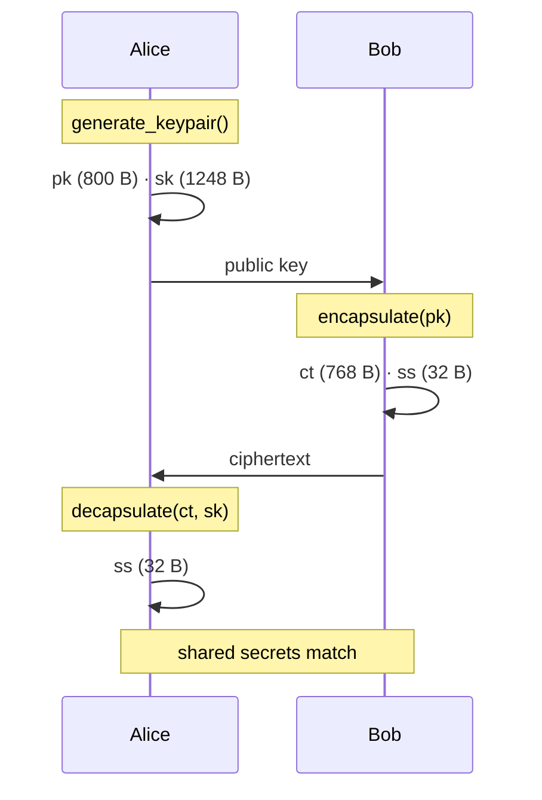

# VORTEX-256

**A lattice KEM built on Rotational Module Learning With Errors (RotMLWE).**

Same footprint as Kyber-512 · Entirely different mathematics · Standalone library

[](https://bajpailabs.com)
[](https://github.com/bajpai-labs/vortex-pqc/actions/workflows/ci.yml)
[](https://pypi.org/project/vortex-pqc/)
[](https://pypi.org/project/vortex-pqc/)
[](LICENSE)
[](https://postquantumlabs.in/library/vortex-pqc)
[](https://postquantumlabs.in/docs/vortex-pqc)

A [Bajpai Labs](https://bajpailabs.com) project · [postquantumlabs.in/library/vortex-pqc](https://postquantumlabs.in/library/vortex-pqc)

## How it works

```
         ρ  ──▶  a₀ ──σ──▶  a₁ ──σ──▶  a₂ ──σ──▶  …
                    Frobenius orbit of a single ring element
                              │
                 bᵢ = aᵢ · s + eᵢ   (K correlated instances)
                              │
                 pk  ·  ct  ·  32-byte shared secret
```

Standard ML-KEM (Kyber) samples a full `k×k` matrix of random ring elements.
**VORTEX-256** samples **one** element `a`, then derives the public structure
from its **Frobenius orbit**:

```
σ : f(x) ↦ f(x³ mod x²⁵⁶+1)

a₀ = a
a₁ = σ(a₀)
bᵢ = aᵢ · s + eᵢ
```

One secret `s`. K rotations. A new hardness assumption — **RotMLWE**.

## At a glance

| Object | Size |
|:-------|-----:|
| Public key | 800 B |
| Private key | 1 248 B |
| Ciphertext | 768 B |
| Shared secret | 32 B |

| | Kyber-512 | VORTEX-256 |
|:--|:--:|:--:|
| XOF calls at keygen | 4 | **1** |
| Secret type | vector | **scalar** |
| Assumption | MLWE | **RotMLWE** |

## Install

```bash
pip install vortex-pqc
```

No runtime dependencies. Compiles an optional native extension when a C toolchain
is present; otherwise falls back to a pure-Python reference.

## Quick start

```python
from vortex_pqc import generate_keypair, encapsulate, decapsulate

alice = generate_keypair()
bob   = encapsulate(alice.public_key)

# Bob sends bob.data (768 B) to Alice
alice_secret = decapsulate(bob.data, alice.private_key)

assert alice_secret == bob.shared_secret
```

## Key exchange



## PEM keys

```python
from vortex_pqc import PEMKind, write_pem_file, read_pem_file

write_pem_file("key.pem", PEMKind.PRIVATE_KEY, alice.private_key)
sk = read_pem_file("key.pem", PEMKind.PRIVATE_KEY)
```

```
-----BEGIN VORTEX256 PRIVATE KEY-----
AQDQABAAABAAAA0AAAAAAPDP/gzQAhAAAAAAAA3QAA0AAPDPAQAAASAAAADQ/wwA
...
-----END VORTEX256 PRIVATE KEY-----
```

Private key files are written with mode `0600`.

## C library

```bash
cd c && make lib && make test && make demo
```

```c
#include "vortex_pqc.h"

uint8_t pk[VORTEX_PUBLIC_KEY_BYTES];
uint8_t sk[VORTEX_PRIVATE_KEY_BYTES];
uint8_t ct[VORTEX_CIPHERTEXT_BYTES];
uint8_t ss[VORTEX_SHARED_SECRET_BYTES];

vortex_keypair(pk, sk);
vortex_enc(pk, ct, ss);
vortex_dec(ct, sk, ss);
```

## Documentation

| Guide | For | You'll learn |
|:------|:----|:-------------|
| [Overview](docs/overview.md) | Everyone | What VORTEX is, design goals, positioning |
| [Quickstart](docs/getting-started.md) | Users | Install, first exchange, PEM files |
| [Integration guide](docs/guides-key-exchange.md) | Developers | Client–server protocol, session keys |
| [Core concepts](docs/concepts.md) | Learners | KEM, RotMLWE, Frobenius, FO transform |
| [Security model](docs/security.md) | Security engineers | Threat model, guarantees, limitations |
| [API reference](docs/api-reference.md) | Integrators | Python and C API, byte layouts |
| [Comparison](docs/comparison.md) | Evaluators | vs ML-KEM, NTRU, other PQC |
| [FAQ](docs/faq.md) | Everyone | Common questions answered |

Also available on the web:

- [Library home](https://postquantumlabs.in/library/vortex-pqc)
- [Published docs](https://postquantumlabs.in/docs/vortex-pqc)
- [In-repo docs](docs/README.md)

## Development

```bash
git clone https://github.com/bajpai-labs/vortex-pqc.git
cd vortex-pqc
python3 -m venv .venv && source .venv/bin/activate
pip install -e ".[dev]"
make test
```

See the [Development Guide](docs/development.md) for the full workflow.

## Security

> **Research prototype.** VORTEX-256 introduces a novel hardness assumption that
> has not received the years of independent cryptanalysis behind NIST-standardised
> ML-KEM. Suitable for research, education, and prototyping. **Not recommended
> for production** without a formal security review.

## Related

This project is **fully independent** from
[Kyber-PQC](https://github.com/krish567366/Kyber-PQC) (ML-KEM-512).

---

## Institutional backing

**Post-Quantum Labs** is an open-source R&D initiative of **Bajpai Labs**.
Frameworks, kernel-level optimizations, and cryptographic implementations here
are engineered and maintained by the core systems architecture team.

| Hub | Link |
|:----|:-----|
| Enterprise | [bajpailabs.com](https://bajpailabs.com) |
| Documentation | [postquantumlabs.com](https://postquantumlabs.com) |
| Library | [postquantumlabs.in/library/vortex-pqc](https://postquantumlabs.in/library/vortex-pqc) |

> **Enterprise support:** Need deterministic sub-microsecond performance,
> hardware–software co-design, or custom PQC migration frameworks?
> Contact [Bajpai Labs](https://bajpailabs.com) at partner@bajpailabs.com.

### Maintenance & ownership

This library is part of the open-source ecosystem developed by Post-Quantum Labs,
a division of Bajpai Labs.

- **Corporate hub:** https://bajpailabs.com
- **Documentation & benchmarks:** https://postquantumlabs.com
- **Inquiries:** research@postquantumlabs.com · partner@bajpailabs.com

## License

MIT License. See [LICENSE](LICENSE) for details.
