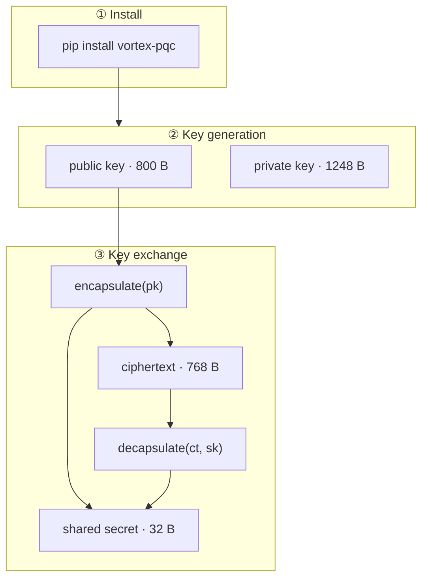

<p align="center">
  
  
  
</p>

<h1 align="center">VORTEX-256 Documentation</h1>

<p align="center">
  <strong>The post-quantum KEM built on Rotational Module Learning With Errors</strong><br/>
  <sub>Install in 60 seconds · Integrate in 15 minutes · Understand the math when you're ready</sub>
</p>

<p align="center">
  <a href="getting-started.md"></a>
  <a href="overview.md"></a>
  <a href="api-reference.md"></a>
  <a href="https://github.com/bajpai-labs/vortex-pqc"></a>
  <a href="https://pypi.org/project/vortex-pqc/"></a>
</p>

<br/>

## Start here

<table>
<thead>
<tr>
<th align="center" width="8%"></th>
<th align="left" width="30%">Path</th>
<th align="left" width="42%">You'll accomplish</th>
<th align="center" width="12%">Time</th>
</tr>
</thead>
<tbody>
<tr>
<td align="center">🚀</td>
<td><a href="getting-started.md"><strong>Quickstart</strong></a></td>
<td>Install, run a key exchange, verify shared secrets match</td>
<td align="center">5 min</td>
</tr>
<tr>
<td align="center">📖</td>
<td><a href="overview.md"><strong>Overview</strong></a></td>
<td>Understand what VORTEX-256 is and when to use it</td>
<td align="center">10 min</td>
</tr>
<tr>
<td align="center">🔌</td>
<td><a href="guides-key-exchange.md"><strong>Integration guide</strong></a></td>
<td>Wire VORTEX into a real client–server protocol</td>
<td align="center">20 min</td>
</tr>
<tr>
<td align="center">🔬</td>
<td><a href="concepts.md"><strong>Core concepts</strong></a></td>
<td>Learn KEM, RotMLWE, Frobenius orbits, implicit rejection</td>
<td align="center">25 min</td>
</tr>
<tr>
<td align="center">🛡</td>
<td><a href="security.md"><strong>Security model</strong></a></td>
<td>Threat model, guarantees, limitations, responsible use</td>
<td align="center">15 min</td>
</tr>
</tbody>
</table>

<br/>

## Documentation map

### Learn

<table>
<thead>
<tr><th align="left">Document</th><th align="left">Description</th></tr>
</thead>
<tbody>
<tr><td><a href="overview.md">Overview</a></td><td>What VORTEX-256 is, design goals, positioning vs ML-KEM</td></tr>
<tr><td><a href="concepts.md">Core concepts</a></td><td>KEM primitives, RotMLWE, Frobenius orbit, FO transform</td></tr>
<tr><td><a href="cryptography.md">Cryptography deep dive</a></td><td>Full mathematical specification and correctness proof</td></tr>
<tr><td><a href="comparison.md">Comparison guide</a></td><td>VORTEX vs Kyber, NTRU, and other lattice KEMs</td></tr>
<tr><td><a href="glossary.md">Glossary</a></td><td>Terms and notation used across these docs</td></tr>
</tbody>
</table>

### Build

<table>
<thead>
<tr><th align="left">Document</th><th align="left">Description</th></tr>
</thead>
<tbody>
<tr><td><a href="getting-started.md">Quickstart</a></td><td>Install, first exchange, backends, troubleshooting</td></tr>
<tr><td><a href="guides-key-exchange.md">Key exchange guide</a></td><td>Alice–Bob protocol, network serialization, session keys</td></tr>
<tr><td><a href="guides-key-management.md">Key management</a></td><td>PEM files, rotation, storage, permissions</td></tr>
<tr><td><a href="guides-python.md">Python guide</a></td><td>Package API patterns, backends, error handling</td></tr>
<tr><td><a href="guides-c-library.md">C library guide</a></td><td>Static linking, headers, memory safety, embedding</td></tr>
<tr><td><a href="performance.md">Performance</a></td><td>Benchmarks, native vs pure Python, optimization notes</td></tr>
</tbody>
</table>

### Reference

<table>
<thead>
<tr><th align="left">Document</th><th align="left">Description</th></tr>
</thead>
<tbody>
<tr><td><a href="api-reference.md">API reference</a></td><td>Every Python and C function, types, constants</td></tr>
<tr><td><a href="pem-format.md">PEM format</a></td><td>Encoding specification for keys and ciphertexts</td></tr>
<tr><td><a href="troubleshooting.md">Troubleshooting</a></td><td>Common errors, diagnostics, debug playbook</td></tr>
<tr><td><a href="faq.md">FAQ</a></td><td>Frequently asked questions</td></tr>
</tbody>
</table>

### Contribute

<table>
<thead>
<tr><th align="left">Document</th><th align="left">Description</th></tr>
</thead>
<tbody>
<tr><td><a href="architecture.md">Architecture</a></td><td>Repository layout, backends, CI/CD, doc sync pipeline</td></tr>
<tr><td><a href="development.md">Development guide</a></td><td>Local setup, testing, linting, releases</td></tr>
<tr><td><a href="security.md#reporting-vulnerabilities">Security</a></td><td>Vulnerability reporting and responsible disclosure</td></tr>
</tbody>
</table>

<br/>

## At a glance



<table>
<thead>
<tr>
<th align="left">Property</th>
<th align="left">VORTEX-256</th>
<th align="left">ML-KEM-512 (Kyber)</th>
</tr>
</thead>
<tbody>
<tr><td>Hardness assumption</td><td><strong>RotMLWE</strong></td><td>MLWE</td></tr>
<tr><td>Public structure</td><td>1 element + K Frobenius rotations</td><td>k×k uniform matrix</td></tr>
<tr><td>Secret</td><td>Scalar <code>s ∈ R_q</code></td><td>Vector <code>s ∈ R_q^k</code></td></tr>
<tr><td>Keygen XOF calls</td><td><strong>1</strong></td><td>4</td></tr>
<tr><td>Public key</td><td>800 B</td><td>800 B</td></tr>
<tr><td>Ciphertext</td><td>768 B</td><td>768 B</td></tr>
<tr><td>Standardisation</td><td>Research preview</td><td>FIPS 203</td></tr>
</tbody>
</table>

<br/>

## 60-second example

```python
from vortex_pqc import generate_keypair, encapsulate, decapsulate

alice = generate_keypair()
bob   = encapsulate(alice.public_key)
assert decapsulate(bob.data, alice.private_key) == bob.shared_secret
```

<br/>

## Security notice

> **Research preview.** VORTEX-256 introduces a novel cryptographic assumption.
> It is suitable for research, education, and prototyping. It is **not**
> NIST-standardised. Read the [Security model](security.md) before any
> production evaluation.

<br/>

<p align="center">
  <sub>
    Published from <a href="https://github.com/bajpai-labs/vortex-pqc">bajpai-labs/vortex-pqc</a>
    · Synced to <a href="https://github.com/bajpai-labs/documentation/tree/main/docs/vortex-pqc">bajpai-labs/documentation</a>
    · MIT © <a href="https://github.com/bajpai-labs">Bajpai Labs</a>
  </sub>
</p>
