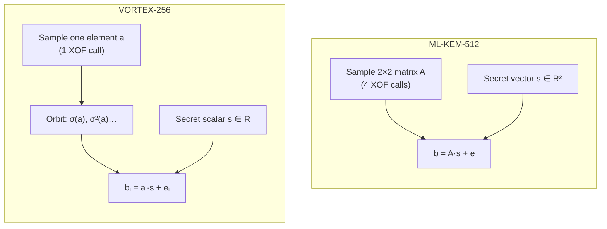

<p align="center">
  <a href="README.md">← Documentation</a>
  &nbsp;·&nbsp;
  <strong>Comparison Guide</strong>
  &nbsp;·&nbsp;
  <a href="security.md">Security →</a>
</p>

<h1 align="center">Comparison Guide</h1>

<p align="center">
  How VORTEX-256 compares to ML-KEM, NTRU, and other post-quantum KEMs
</p>

<br/>

## Summary

<table>
<thead>
<tr>
<th align="left">Property</th>
<th align="center">VORTEX-256</th>
<th align="center">ML-KEM-512</th>
<th align="center">ML-KEM-768</th>
</tr>
</thead>
<tbody>
<tr><td>Hardness assumption</td><td align="center"><strong>RotMLWE</strong></td><td align="center">MLWE</td><td align="center">MLWE</td></tr>
<tr><td>Standardised</td><td align="center">❌ Research</td><td align="center">✅ FIPS 203</td><td align="center">✅ FIPS 203</td></tr>
<tr><td>Public key</td><td align="center">800 B</td><td align="center">800 B</td><td align="center">1 184 B</td></tr>
<tr><td>Private key</td><td align="center">1 248 B</td><td align="center">1 632 B</td><td align="center">2 400 B</td></tr>
<tr><td>Ciphertext</td><td align="center">768 B</td><td align="center">768 B</td><td align="center">1 088 B</td></tr>
<tr><td>Shared secret</td><td align="center">32 B</td><td align="center">32 B</td><td align="center">32 B</td></tr>
<tr><td>Keygen XOF calls</td><td align="center"><strong>1</strong></td><td align="center">4</td><td align="center">9</td></tr>
<tr><td>Secret type</td><td align="center">Scalar</td><td align="center">Vector (k=2)</td><td align="center">Vector (k=3)</td></tr>
<tr><td>Est. quantum security</td><td align="center">~128-bit</td><td align="center">~128-bit</td><td align="center">~192-bit</td></tr>
</tbody>
</table>

<br/>

## VORTEX-256 vs ML-KEM-512 (Kyber-512)

### What's the same

- Ring: `ℤ₃₃₂₉[x]/(x²⁵⁶+1)`
- Public key and ciphertext **wire sizes**
- FO transform for CCA security
- SHA-3 / SHAKE hash functions
- CBD noise sampling
- Implicit rejection on bad ciphertexts

### What's different



| Dimension | ML-KEM-512 | VORTEX-256 | Winner |
|:----------|:-----------|:-----------|:-------|
| Maturity / audit history | Extensive (NIST, academia) | Research preview | ML-KEM |
| Novelty / research value | Standard | New assumption | VORTEX |
| Key expansion cost | 4 XOF calls | 1 XOF + permutations | VORTEX |
| Private key size | 1 632 B | 1 248 B | VORTEX |
| Production readiness | ✅ | ❌ (needs review) | ML-KEM |
| Wire compatibility | — | Same pk/ct sizes | Tie |

<br/>

## When to choose which

<table>
<thead>
<tr><th align="left">Scenario</th><th align="left">Recommendation</th></tr>
</thead>
<tbody>
<tr>
<td>Government / regulated / FIPS-required</td>
<td><strong>ML-KEM</strong> (FIPS 203) via <a href="https://github.com/krish567366/Kyber-PQC">Kyber-PQC</a></td>
</tr>
<tr>
<td>Production TLS, VPN, messaging</td>
<td><strong>ML-KEM</strong> until VORTEX receives independent audit</td>
</tr>
<tr>
<td>Research on lattice assumptions</td>
<td><strong>VORTEX-256</strong> — novel RotMLWE structure</td>
</tr>
<tr>
<td>Education / benchmarking</td>
<td>Either — VORTEX shows alternative construction at same sizes</td>
</tr>
<tr>
<td>Exploring Frobenius-based key compression</td>
<td><strong>VORTEX-256</strong></td>
</tr>
<tr>
<td>Need 192-bit quantum security</td>
<td><strong>ML-KEM-768</strong> or <strong>ML-KEM-1024</strong></td>
</tr>
</tbody>
</table>

<br/>

## Comparison with other PQC families

<table>
<thead>
<tr>
<th align="left">Family</th>
<th align="left">Examples</th>
<th align="left">Assumption</th>
<th align="left">vs VORTEX</th>
</tr>
</thead>
<tbody>
<tr>
<td>Lattice (module)</td>
<td>ML-KEM, Saber</td>
<td>MLWE / MLWR</td>
<td>Closest competitor; VORTEX uses RotMLWE variant</td>
</tr>
<tr>
<td>Lattice (NTRU)</td>
<td>NTRU, HPS</td>
<td>NTRU / SVP</td>
<td>Different structure; VORTEX has smaller sk</td>
</tr>
<tr>
<td>Code-based</td>
<td>Classic McEliece</td>
<td>Decoding random codes</td>
<td>Much larger keys (100+ KB); mature but bulky</td>
</tr>
<tr>
<td>Hash-based</td>
<td>SPHINCS+</td>
<td>Hash function security</td>
<td>Signatures, not KEM; different use case</td>
</tr>
<tr>
<td>Isogeny</td>
<td>SIKE (broken)</td>
<td>Supersingular isogeny</td>
<td>Not recommended — broken 2022</td>
</tr>
</tbody>
</table>

<br/>

## Migration notes

### From ML-KEM / Kyber to VORTEX

VORTEX-256 has the **same public key and ciphertext sizes** as Kyber-512, but
**different byte layouts and algorithms**. You cannot interchange keys or
ciphertexts between the two.

```
Migration requires:
  1. Replace crypto library (kyber-pqc → vortex-pqc)
  2. Re-generate all key pairs
  3. Update PEM labels (KYBER512 → VORTEX256)
  4. Re-validate your protocol security with the new assumption
```

### Coexistence

Both libraries can coexist in the same organisation for different purposes:

| Library | Repo | Use |
|:--------|:-----|:----|
| `kyber-pqc` | [krish567366/Kyber-PQC](https://github.com/krish567366/Kyber-PQC) | Production ML-KEM-512 |
| `vortex-pqc` | [bajpai-labs/vortex-pqc](https://github.com/bajpai-labs/vortex-pqc) | Research RotMLWE |

<br/>

<p align="center">
  <a href="security.md">Security model</a>
  &nbsp;·&nbsp;
  <a href="overview.md">Overview</a>
  &nbsp;·&nbsp;
  <a href="getting-started.md">Quickstart</a>
</p>
