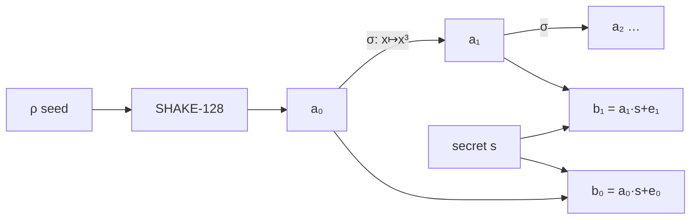
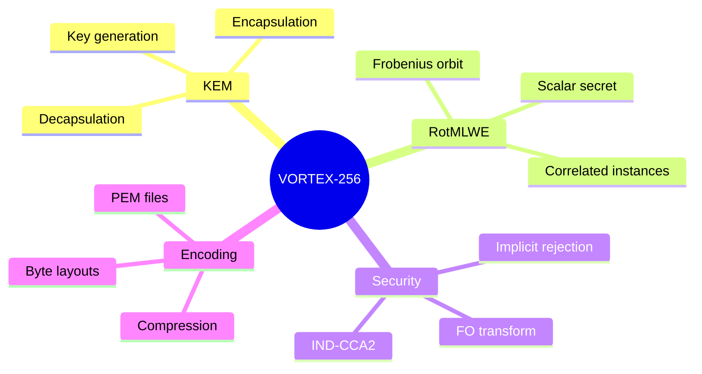

<p align="center">
  <a href="README.md">← Documentation</a>
  &nbsp;·&nbsp;
  <strong>Core Concepts</strong>
  &nbsp;·&nbsp;
  <a href="cryptography.md">Cryptography deep dive →</a>
</p>

<h1 align="center">Core Concepts</h1>

<p align="center">
  The ideas behind VORTEX-256 — explained without requiring a PhD
</p>

<br/>

## 1 · Key Encapsulation Mechanisms

A **KEM** is a public-key primitive designed for one job: establish a shared
secret between two parties.

| Party | Action | Output |
|:------|:-------|:-------|
| Receiver (Alice) | Generate key pair | Public key (publish) + private key (keep) |
| Sender (Bob) | Encapsulate to Alice's public key | Ciphertext (send) + shared secret (keep) |
| Receiver (Alice) | Decapsulate with private key | Same shared secret |

Unlike RSA encryption, the sender also learns the shared secret during
encapsulation. Both parties arrive at the same 32-byte value without ever
transmitting it.

```python
# This is the entire contract of a KEM:
pk, sk = keygen()
ct, ss_sender   = encapsulate(pk)
ss_receiver     = decapsulate(ct, sk)
assert ss_sender == ss_receiver
```

→ Integration patterns: [Key exchange guide](guides-key-exchange.md)

<br/>

## 2 · The ring VORTEX operates in

All VORTEX arithmetic happens in a polynomial ring:

```
R     = ℤ[x] / (x²⁵⁶ + 1)
R_q   = R / qR        where q = 3329
```

**Intuition:** A ring element is a polynomial with 256 coefficients, each in
`[0, 3329)`. Multiplying polynomials uses the rule `x²⁵⁶ = −1` (negacyclic
convolution).

| Parameter | Value | Why |
|:----------|------:|:----|
| `n = 256` | Ring dimension | Standard for lattice KEMs at 128-bit security |
| `q = 3329` | Prime modulus | NTT-friendly; same as ML-KEM |

<br/>

## 3 · RotMLWE — the novel assumption

### Module-LWE (what Kyber uses)

Sample a random `k×k` matrix `A` of ring elements. Hide a secret vector `s`:

```
b = A · s + e
```

Security: recovering `s` from `(A, b)` is hard (Module-LWE).

### Rotational MLWE (what VORTEX uses)

Sample **one** ring element `a`. Generate its orbit under the Frobenius map `σ`:

```
a₀ = a
a₁ = σ(a) = a(x³ mod x²⁵⁶+1)
a₂ = σ²(a)
…
```

Hide a **scalar** secret `s` under each rotation:

```
bᵢ = aᵢ · s + eᵢ     for i = 0, …, K−1
```



**Why this is different:** The public key components are algebraically
correlated — they share the same base `a` and secret `s`. Breaking VORTEX
requires exploiting this structure across all K instances simultaneously.

**Efficiency gain:** Kyber-512 expands a `2×2` matrix (4 XOF calls). VORTEX
needs **1 XOF call** then `K−1` cheap coefficient permutations.

→ Full spec: [Cryptography](cryptography.md)

<br/>

## 4 · The Frobenius automorphism

The map `σ(f(x)) = f(x³ mod x²⁵⁶+1)` is a **ring automorphism** because
`gcd(3, 512) = 1`.

For each coefficient `aᵢ` at position `i`:

```
x^(3i) mod (x²⁵⁶+1):
  if 3i mod 512 < 256  →  contribute +aᵢ at position (3i mod 512)
  if 3i mod 512 ≥ 256  →  contribute −aᵢ at position (3i mod 512 − 256)
```

This is a pure permutation of coefficients — no multiplication needed. It is
orders of magnitude cheaper than sampling a new random polynomial.

<br/>

## 5 · Noise and correctness

Small random errors (`e`, `e'`, `e''`) are sampled from the **Centered
Binomial Distribution** CBD(η):

| Parameter | η value | Used for |
|:----------|:--------|:---------|
| `η₁ = 3` | Key generation noise | Secret `s`, keygen errors |
| `η₂ = 2` | Encapsulation noise | Ephemeral `r`, encaps errors |

During decapsulation, noise terms mostly cancel:

```
v − Σᵢ s·uᵢ ≈ encode(message)
```

The remaining noise must stay below `q/4 = 832` for correct decoding. VORTEX's
parameter choices keep failure probability negligible.

<br/>

## 6 · Fujisaki–Okamoto (CCA security)

VORTEX is **IND-CCA2 secure** via the FO transform:

1. A random 32-byte message `m` is encrypted inside the ciphertext
2. The shared secret is derived as `K = KDF(hash(m) ‖ hash(ciphertext))`
3. Decapsulation recovers `m'` and **re-encrypts** to verify the ciphertext

If re-encryption doesn't match → **implicit rejection** (see below).

This means VORTEX is safe to use in protocols where an attacker can submit
crafted ciphertexts (e.g. TLS-like settings).

<br/>

## 7 · Implicit rejection

When a ciphertext is tampered or corrupt, VORTEX does **not** return an error.
Instead it returns a **pseudorandom** 32-byte value derived from a secret
rejection token `z` stored in the private key:

```
if re_encrypted_ct == received_ct:
    return KDF(correct_material)
else:
    return KDF(z ‖ hash(ct))     ← looks random, wrong value
```

**Why this matters:** Returning errors on bad ciphertexts can leak information
through timing or error channels (padding oracle attacks). Implicit rejection
closes this attack vector.

<br/>

## 8 · Compression

Ciphertexts are compressed to match Kyber-512 wire sizes:

| Component | Bits/coefficient | Bytes |
|:----------|----------------:|------:|
| `u₀`, `u₁` | 10 (`dᵤ`) | 320 each |
| `v` | 4 (`d_v`) | 128 |
| **Total** | | **768** |

Compression introduces rounding error, but the FO transform's re-encryption
check ensures tampered ciphertexts are caught regardless.

<br/>

## Concept map



<br/>

## Next

| If you want to… | Read |
|:----------------|:-----|
| See the full math | [Cryptography](cryptography.md) |
| Integrate into code | [Key exchange guide](guides-key-exchange.md) |
| Compare to Kyber | [Comparison guide](comparison.md) |
| Look up a term | [Glossary](glossary.md) |
