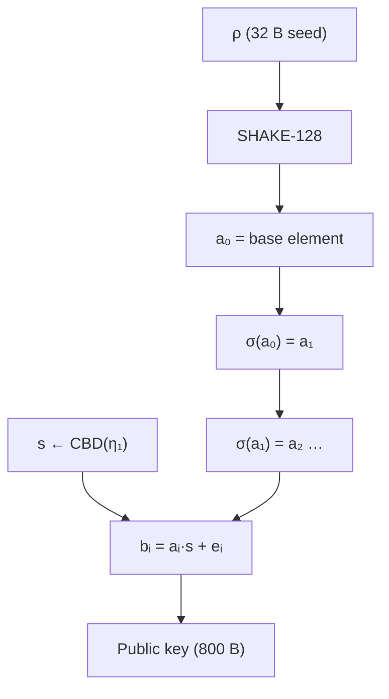

<p align="center">
  <a href="README.md">← Documentation</a>
  &nbsp;·&nbsp;
  <strong>Cryptography</strong>
  &nbsp;·&nbsp;
  <a href="api-reference.md">API Reference →</a>
</p>

<h1 align="center">Cryptography</h1>

<p align="center">
  The mathematics behind VORTEX-256 —<br/>
  <strong>Rotational Module Learning With Errors (RotMLWE)</strong>
</p>

<br/>



<br/>

## Ring and notation

```
R     = Z[x] / (x²⁵⁶ + 1)
R_q   = R / qR,   where q = 3329
```

Coefficients are represented as integers in `[0, q)`. Polynomial multiplication
is performed in `R_q` (negacyclic convolution: `x²⁵⁶ = −1`).

---

## The RotMLWE problem

### Standard MLWE (Kyber)

In Module-LWE, the public key contains a `k×k` matrix `A` of uniform ring
elements and a vector `b = A·s + e`, where `s` is a small secret vector and
`e` is small noise.

### VORTEX RotMLWE

VORTEX replaces the matrix `A` with **K correlated ring elements** derived from
a single base element via the Frobenius automorphism:

```
σ: f(x) ↦ f(x³ mod x²⁵⁶+1)
```

Because `gcd(3, 512) = 1`, `σ` is a ring automorphism of `R`.

```
a₀ = XOF(ρ)                    ← one SHAKE-128 expansion
a₁ = σ(a₀)                     ← cheap permutation, no extra XOF
...
a_{K-1} = σ^{K-1}(a₀)
```

The public key hides a **single** secret `s ∈ R_q` (not a vector) under each
rotation:

```
bᵢ = aᵢ · s + eᵢ     for i = 0, …, K−1
```

**Public key:** `pk = ρ ‖ pack(b₀) ‖ … ‖ pack(b_{K-1})`

**Private key:** `sk = pack(s) ‖ pk ‖ H(pk) ‖ z`

---

## Key generation

```
Input:  random ρ (32 B), σ (32 B)
Output: pk (800 B), sk (1248 B)

1. a₀ ← XOF(ρ);  aᵢ ← σ(aᵢ₋₁)  for i = 1…K−1
2. s  ← CBD(η₁, σ, nonce=0)
3. bᵢ ← aᵢ·s + CBD(η₁, σ, nonce=i+1)
4. pk ← ρ ‖ pack(b₀) ‖ pack(b₁)
5. sk ← pack(s) ‖ pk ‖ SHA3-256(pk) ‖ random z (32 B)
```

---

## Encapsulation (FO transform)

VORTEX uses the **Fujisaki–Okamoto (FO)** transform for IND-CCA2 security,
analogous to ML-KEM.

```
Input:  pk, random m (32 B)
Output: ct (768 B), shared secret K (32 B)

1. pkh ← SHA3-256(pk)
2. (K̄, coins) ← SHA3-512(m ‖ pkh)
3. r ← CBD(η₁, coins, 0)
4. uᵢ ← aᵢ·r + CBD(η₂, coins, i+1)     [compressed in ct]
5. v  ← Σᵢ bᵢ·r + CBD(η₂, coins, K+1) + encode(m)
6. ct ← compress(u₀) ‖ compress(u₁) ‖ compress(v)
7. K  ← SHAKE-256(K̄ ‖ SHA3-256(ct))
```

---

## Decapsulation

```
Input:  ct, sk
Output: shared secret K (32 B)

1. Decompress u₀, u₁, v from ct
2. w ← v − Σᵢ s·uᵢ
3. m′ ← decode(w)
4. Re-encapsulate deterministically with m′ → ct′
5. If ct′ = ct:
       K ← SHAKE-256(K̄′ ‖ H(ct))
   Else (implicit rejection):
       K ← SHAKE-256(z ‖ H(ct))
```

Implicit rejection ensures the decapsulation function never leaks whether a
ciphertext was valid through timing or error channels.

---

## Correctness

During decapsulation:

```
v − Σᵢ s·uᵢ
  = Σᵢ(aᵢ·s + eᵢ)·r + e″ + enc(m) − Σᵢ s·(aᵢ·r + e′ᵢ)
  = Σᵢ eᵢ·r − Σᵢ s·e′ᵢ + e″ + enc(m)
  ≈ enc(m)
```

Noise terms are small relative to the decoding threshold `q/4 = 832`.
With `η₁=3`, `η₂=2`, `K=2`, the expected noise magnitude is well within
tolerance, giving negligible failure probability.

---

## Parameters

| Symbol | Value | Role |
|--------|------:|------|
| `n` | 256 | Ring dimension |
| `q` | 3329 | Prime modulus (NTT-friendly) |
| `K` | 2 | Number of Frobenius rotations |
| `η₁` | 3 | CBD parameter for keygen noise |
| `η₂` | 2 | CBD parameter for encaps noise |
| `dᵤ` | 10 | Compression bits per u-coefficient |
| `d_v` | 4 | Compression bits per v-coefficient |

### Hash functions (FIPS 202)

| Function | Usage |
|----------|-------|
| SHAKE-128 | Expand `ρ` to base element `a₀` |
| SHAKE-256 | PRF for CBD sampling; KDF for shared secret |
| SHA3-256 | Hash public key; hash ciphertext |
| SHA3-512 | FO transform (`G` function) |

---

## Comparison with ML-KEM-512 (Kyber-512)

| Property | ML-KEM-512 | VORTEX-256 |
|----------|-----------|------------|
| Hardness | MLWE | **RotMLWE** |
| Matrix expansion | k² XOF calls | **1 XOF + K−1 permutations** |
| Secret type | Vector `s ∈ R_q^k` | **Scalar `s ∈ R_q`** |
| Public key | 800 B | 800 B |
| Private key | 1632 B | **1248 B** |
| Ciphertext | 768 B | 768 B |
| Shared secret | 32 B | 32 B |
| Standardisation | FIPS 203 | **Research prototype** |

---

## Security considerations

### Strengths

- Based on lattice problems (RLWE family) with a novel algebraic structure
- FO transform provides IND-CCA2 security (same framework as ML-KEM)
- Implicit rejection prevents padding oracle attacks
- Constant-time comparison in decapsulation (pure Python: `hmac.compare_digest`)

### Limitations

- **Not NIST-standardised.** VORTEX-256 is a research prototype.
- RotMLWE is a **new assumption** — no extensive cryptanalytic literature yet.
- K correlated instances share structure; security reduction to RLWE for K>1
  is an open research question.
- The pure-Python backend is not constant-time; use the C extension for
  timing-sensitive deployments (after security review).

### Recommended use

| Use case | Recommendation |
|----------|----------------|
| Research / prototyping | ✅ Suitable |
| Education / benchmarking | ✅ Suitable |
| Production TLS / VPN | ❌ Not recommended without formal review |
| Long-term archival keys | ❌ Use NIST-standardised ML-KEM instead |

---

## References

- ML-KEM (FIPS 203): NIST post-quantum KEM standard
- Fujisaki–Okamoto transform: CCA security from CPA KEM
- Module-LWE: foundation for Kyber/Saber family
- Frobenius automorphisms in cyclotomic rings
