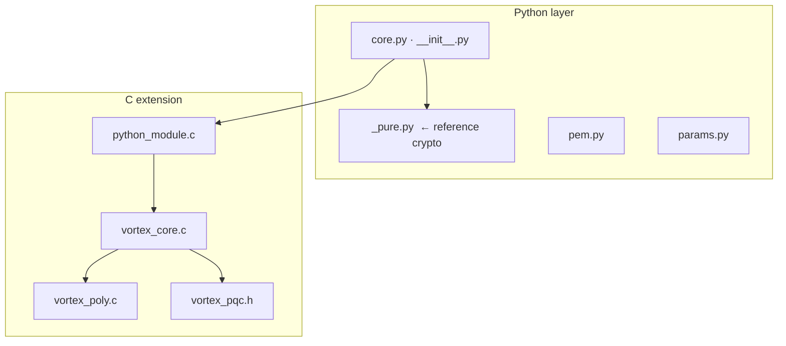

<p align="center">
  <a href="README.md">← Documentation</a>
  &nbsp;·&nbsp;
  <strong>Development Guide</strong>
  &nbsp;·&nbsp;
  <a href="architecture.md">Architecture →</a>
</p>

<h1 align="center">Development Guide</h1>

<p align="center">
  Set up your environment, run tests, ship releases,<br/>
  and contribute to <strong>vortex-pqc</strong> with confidence.
</p>

<br/>

## Quick setup

```bash
git clone https://github.com/bajpai-labs/vortex-pqc.git
cd vortex-pqc

python3 -m venv .venv
source .venv/bin/activate

pip install -U pip wheel
pip install -e ".[dev]"

make test
```

Expected output ends with **26 passed** (Python) and **All tests passed** (C).

<br/>

## Daily commands

<table>
<thead>
<tr>
<th align="left">Command</th>
<th align="left">What it does</th>
</tr>
</thead>
<tbody>
<tr><td><code>make test</code></td><td>Python + C test suites</td></tr>
<tr><td><code>make test-python</code></td><td>Python tests only</td></tr>
<tr><td><code>make test-c</code></td><td>C library tests only</td></tr>
<tr><td><code>make lint</code></td><td>flake8 + mypy</td></tr>
<tr><td><code>make build</code></td><td>Build Python wheel → <code>dist/</code></td></tr>
<tr><td><code>make clean</code></td><td>Remove all build artifacts</td></tr>
<tr><td><code>make -C c demo</code></td><td>Run Alice–Bob CLI demo</td></tr>
</tbody>
</table>

<br/>

## Where to edit



<table>
<thead>
<tr>
<th align="left">Change</th>
<th align="left">Files</th>
</tr>
</thead>
<tbody>
<tr><td>Public Python API</td><td><code>src/vortex_pqc/core.py</code>, <code>__init__.py</code></td></tr>
<tr><td>Crypto logic (reference)</td><td><code>src/vortex_pqc/_pure.py</code></td></tr>
<tr><td>Scheme parameters</td><td><code>src/vortex_pqc/params.py</code></td></tr>
<tr><td>PEM encoding</td><td><code>src/vortex_pqc/pem.py</code></td></tr>
<tr><td>C KEM operations</td><td><code>c/src/vortex_core.c</code></td></tr>
<tr><td>C polynomial math</td><td><code>c/src/vortex_poly.c</code></td></tr>
<tr><td>Python ↔ C bindings</td><td><code>c/src/python_module.c</code></td></tr>
<tr><td>C public header</td><td><code>c/include/vortex_pqc.h</code></td></tr>
</tbody>
</table>

> **Golden rule:** changes to `_pure.py` must be mirrored in the C implementation.
> Both backends must produce identical byte outputs.

<br/>

## Running tests

```bash
# Everything
make test

# Single Python test
python -m pytest src/tests/test_core.py::test_round_trip_basic -v

# With coverage
python -m pytest src/tests/ --cov=vortex_pqc --cov-report=term-missing

# C only
make -C c test
```

### What must always pass

| Suite | File | Covers |
|:------|:-----|:-------|
| Python core | `test_core.py` | Round-trip, rejection, validation |
| Python PEM | `test_pem.py` | Encode/decode, file I/O, permissions |
| C library | `test_vortex.c` | Round-trip, tamper rejection, sizes |

<br/>

## Rebuilding the native extension

After editing C sources:

```bash
pip install -e . --force-reinstall --no-deps
```

Verify:

```python
import vortex_pqc
assert "native" in vortex_pqc.native_backend()
```

<br/>

## Debugging tips

<details>
<summary><strong>Force pure-Python backend</strong></summary>

<br/>

Temporarily move the compiled extension aside to isolate C bugs:

```bash
mv src/vortex_pqc/_native*.so /tmp/
python -m pytest src/tests/ -v
```

</details>

<details>
<summary><strong>Run the C demo</strong></summary>

<br/>

```bash
make -C c demo
./c/examples/demo
```

</details>

<details>
<summary><strong>Benchmark both backends</strong></summary>

<br/>

```python
from vortex_pqc import benchmark_throughput, native_backend

print(f"Backend: {native_backend()}")
print(benchmark_throughput(20))
```

</details>

<br/>

## Lint & type-check

```bash
make lint

# Individual
python -m flake8 src/vortex_pqc/ --max-line-length=100
python -m mypy src/vortex_pqc/ --ignore-missing-imports
```

<br/>

## Shipping a release

### One-time PyPI setup

1. Create project `vortex-pqc` on [pypi.org](https://pypi.org)
2. Generate an API token
3. Add `PYPI_API_TOKEN` to GitHub → Settings → Secrets → Actions

### Release checklist

```
□ Bump version in pyproject.toml
□ Bump __version__ in src/vortex_pqc/__init__.py
□ Run make test && make lint
□ Commit and push to main
□ Create GitHub Release (tag: v0.x.x)
□ CI publishes automatically via release.yml
```

### Manual publish (emergency)

```bash
make build
twine check dist/*
twine upload dist/*
```

<br/>

## Contributor checklist

```
□ Implement in _pure.py (reference)
□ Mirror in C if performance-critical
□ Export from core.py / __init__.py if public
□ Add tests in src/tests/
□ Update docs/api-reference.md
□ Update docs/getting-started.md if user-facing
□ Run make test && make lint
```

<br/>

## Security rules

<table>
<thead>
<tr>
<th align="left">Do</th>
<th align="left">Don't</th>
</tr>
</thead>
<tbody>
<tr>
<td>Use <code>hmac.compare_digest</code> for secret comparisons</td>
<td>Log keys, seeds, or shared secrets</td>
</tr>
<tr>
<td>Clear secret buffers in C with <code>secure_zero</code></td>
<td>Commit <code>.pem</code>, <code>.key</code>, or <code>.env</code> files</td>
</tr>
<tr>
<td>Report vulnerabilities to hello@bajpailabs.com</td>
<td>Skip security tests to make CI green</td>
</tr>
</tbody>
</table>

<br/>

## CI pipeline

Every push and PR to `main` runs:

| Job | Matrix | Steps |
|:----|:-------|:------|
| Python | Ubuntu + macOS × 3.10/3.11/3.12 | install → pytest → lint → mypy |
| C library | Ubuntu + macOS | `make -C c test` |

→ Defined in `.github/workflows/ci.yml`

<br/>

## Documentation sync

Library home: **[postquantumlabs.in/library/vortex-pqc](https://postquantumlabs.in/library/vortex-pqc)**

Published docs: **[postquantumlabs.in/docs/vortex-pqc](https://postquantumlabs.in/docs/vortex-pqc)**

Enterprise: **[Bajpai Labs](https://bajpailabs.com)**

Source is synced to the Bajpai Labs documentation repo (`bajpai-labs/documentation`)
before deployment.

### Automatic (CI)

On every push to `main` that changes `docs/**`, the workflow
`.github/workflows/sync-docs.yml` rsyncs this folder to
`documentation/docs/vortex-pqc/` and commits the result.

### One-time GitHub setup

1. Create a fine-grained or classic PAT with **Contents: Read and write** on
   `bajpai-labs/documentation`
2. In **vortex-pqc** → Settings → Secrets → Actions, add:
   - Name: `DOCS_SYNC_TOKEN`
   - Value: your PAT

### Manual sync (local)

```bash
git clone https://github.com/bajpai-labs/documentation.git ../documentation
chmod +x scripts/sync-docs.sh
./scripts/sync-docs.sh ../documentation
cd ../documentation
git add docs/vortex-pqc/
git commit -m "docs(vortex-pqc): manual sync"
git push origin main
```

<br/>

<p align="center">
  <a href="architecture.md">Architecture</a>
  &nbsp;·&nbsp;
  <a href="api-reference.md">API Reference</a>
  &nbsp;·&nbsp;
  <a href="https://github.com/bajpai-labs/vortex-pqc/issues">Report an issue</a>
</p>
