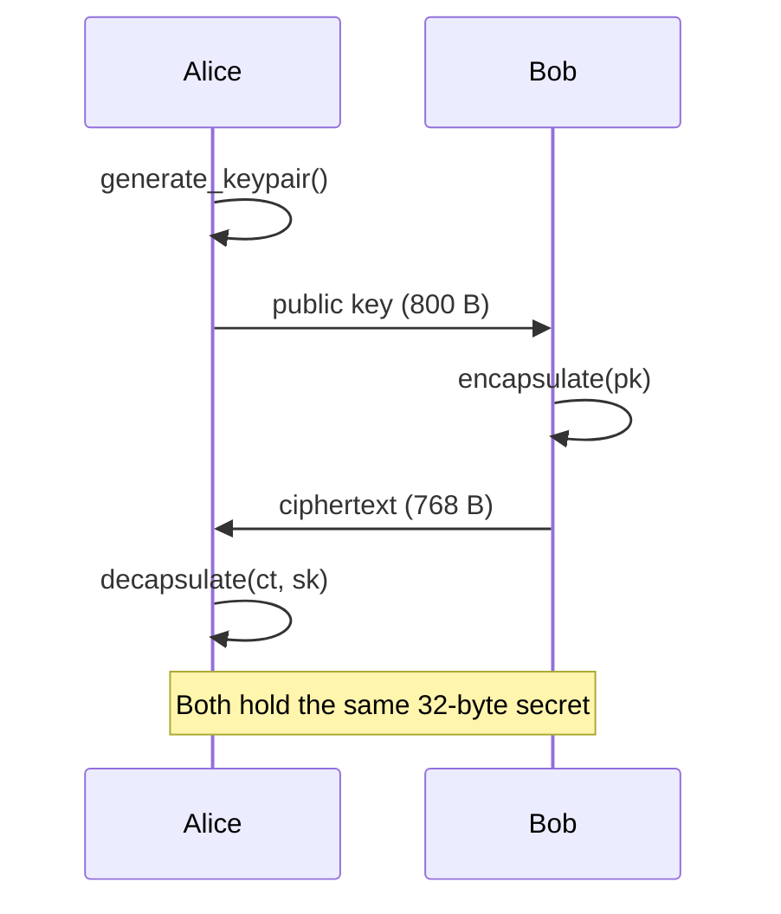

<p align="center">
  <a href="README.md">← Documentation</a>
  &nbsp;·&nbsp;
  <strong>Getting Started</strong>
  &nbsp;·&nbsp;
  <a href="api-reference.md">API Reference →</a>
</p>

<h1 align="center">Getting Started</h1>

<p align="center">
  Install <strong>vortex-pqc</strong>, run your first key exchange,<br/>
  and save keys as PEM files — in under five minutes.
</p>

<br/>

## Before you begin

<table>
<thead>
<tr>
<th align="left">Requirement</th>
<th align="left">Details</th>
</tr>
</thead>
<tbody>
<tr>
<td>Python</td>
<td>3.10 or newer</td>
</tr>
<tr>
<td>C compiler</td>
<td>Optional — enables the fast native backend</td>
</tr>
<tr>
<td>Operating system</td>
<td>Linux · macOS · Windows (pure-Python path)</td>
</tr>
<tr>
<td>Runtime dependencies</td>
<td>None</td>
</tr>
</tbody>
</table>

<br/>

## Step 1 · Install

### From PyPI

```bash
pip install vortex-pqc
```

### From source

```bash
git clone https://github.com/bajpai-labs/vortex-pqc.git
cd vortex-pqc
python3 -m venv .venv
source .venv/bin/activate          # Windows: .venv\Scripts\activate
pip install -e ".[dev]"
```

<details>
<summary><strong>Which backend am I using?</strong></summary>

<br/>

```python
import vortex_pqc
print(vortex_pqc.native_backend())
```

| Output | Meaning |
|:-------|:--------|
| `vortex-pqc-native-aarch64` | C extension active (fast) |
| `vortex-pqc-native-x86_64` | C extension active (fast) |
| `vortex-pqc-pure-python` | Reference implementation (always correct) |

</details>

<br/>

## Step 2 · Your first key exchange

```python
from vortex_pqc import generate_keypair, encapsulate, decapsulate

# Alice generates a key pair
alice = generate_keypair()

# Bob encapsulates a shared secret to Alice's public key
bob = encapsulate(alice.public_key)

# Bob sends bob.data (768 bytes) over the network …

# Alice recovers the same secret
alice_secret = decapsulate(bob.data, alice.private_key)

assert alice_secret == bob.shared_secret
```



<br/>

## Step 3 · Object sizes

```python
from vortex_pqc import (
    PUBLIC_KEY_BYTES,     # 800
    PRIVATE_KEY_BYTES,    # 1248
    CIPHERTEXT_BYTES,     # 768
    SHARED_SECRET_BYTES,  # 32
)
```

<table>
<thead>
<tr>
<th align="left">Object</th>
<th align="center">Bytes</th>
<th align="left">Who holds it</th>
</tr>
</thead>
<tbody>
<tr><td>Public key</td><td align="center">800</td><td>Alice (published)</td></tr>
<tr><td>Private key</td><td align="center">1248</td><td>Alice (secret)</td></tr>
<tr><td>Ciphertext</td><td align="center">768</td><td>Sent by Bob → Alice</td></tr>
<tr><td>Shared secret</td><td align="center">32</td><td>Both parties (derived)</td></tr>
</tbody>
</table>

<br/>

## Step 4 · PEM key files

VORTEX uses standard **Base64 PEM** — not hex — so it works with ordinary PEM tooling.

```python
from vortex_pqc import (
    PEMKind,
    generate_keypair,
    encapsulate,
    write_pem_file,
    read_pem_file,
)

alice = generate_keypair()
bob   = encapsulate(alice.public_key)

write_pem_file("alice_pub.pem",   PEMKind.PUBLIC_KEY,    alice.public_key)
write_pem_file("alice_key.pem",   PEMKind.PRIVATE_KEY,   alice.private_key)
write_pem_file("ciphertext.pem",  PEMKind.CIPHERTEXT,    bob.data)
write_pem_file("secret.pem",      PEMKind.SHARED_SECRET, bob.shared_secret)

# Read back
sk = read_pem_file("alice_key.pem", PEMKind.PRIVATE_KEY)
```

A private key file looks like:

```
-----BEGIN VORTEX256 PRIVATE KEY-----
AQDQABAAABAAAA0AAAAAAPDP/gzQAhAAAAAAAA3QAA0AAPDPAQAAASAAAADQ/wwA
AAAAAA//zPAC0AAO3PARAAAQAAAP3PAQDQAPDPAiAAABAAAA0A/wzQARAAARAA
...
-----END VORTEX256 PRIVATE KEY-----
```

Private key files are written with permissions `0600`.

→ Full spec: [PEM Format](pem-format.md)

<br/>

## Step 5 · C library

```bash
cd c
make lib      # → build/libvortex_pqc.a
make test     # unit tests
make demo     # Alice–Bob CLI demo
```

```c
#include "vortex_pqc.h"
#include <stdio.h>
#include <string.h>

int main(void) {
    uint8_t pk[VORTEX_PUBLIC_KEY_BYTES];
    uint8_t sk[VORTEX_PRIVATE_KEY_BYTES];
    uint8_t ct[VORTEX_CIPHERTEXT_BYTES];
    uint8_t ss_enc[VORTEX_SHARED_SECRET_BYTES];
    uint8_t ss_dec[VORTEX_SHARED_SECRET_BYTES];

    vortex_keypair(pk, sk);
    vortex_enc(pk, ct, ss_enc);
    vortex_dec(ct, sk, ss_dec);

    printf("Match: %s\n",
           memcmp(ss_enc, ss_dec, 32) == 0 ? "yes" : "no");
    return 0;
}
```

<br/>

## Benchmarking

```python
from vortex_pqc import benchmark_throughput

stats = benchmark_throughput(operations=50)
for op, result in stats.items():
    print(f"{op:8s}  {result['mean_ops']:,.0f} ops/s")
```

Optional extras:

```bash
pip install "vortex-pqc[benchmark]"
```

<br/>

## Troubleshooting

<table>
<thead>
<tr>
<th align="left">Error</th>
<th align="left">Cause</th>
<th align="left">Fix</th>
</tr>
</thead>
<tbody>
<tr>
<td><code>Invalid public key length</code></td>
<td>Wrong byte count to <code>encapsulate</code></td>
<td>Pass exactly 800 bytes</td>
</tr>
<tr>
<td><code>Invalid ciphertext length</code></td>
<td>Wrong byte count to <code>decapsulate</code></td>
<td>Pass exactly 768 bytes</td>
</tr>
<tr>
<td><code>invalid data length for PEM</code></td>
<td>Data size doesn't match <code>PEMKind</code></td>
<td>Check kind matches your bytes</td>
</tr>
<tr>
<td>Shared secrets don't match</td>
<td>Mismatched keys or tampered ciphertext</td>
<td>Verify pk/sk/ct belong together</td>
</tr>
</tbody>
</table>

<br/>

## What's next?

<table>
<tr>
<td width="50%">

**Integrating into your app?**
→ [API Reference](api-reference.md)

**Need the math?**
→ [Cryptography](cryptography.md)

</td>
<td width="50%">

**Contributing?**
→ [Development Guide](development.md)

**Understanding the codebase?**
→ [Architecture](architecture.md)

</td>
</tr>
</table>
