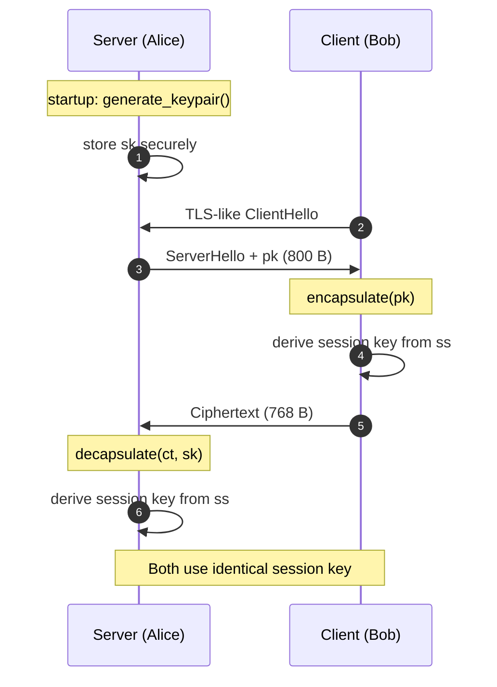

<p align="center">
  <a href="README.md">← Documentation</a>
  &nbsp;·&nbsp;
  <strong>Key Exchange Guide</strong>
  &nbsp;·&nbsp;
  <a href="guides-key-management.md">Key management →</a>
</p>

<h1 align="center">Key Exchange Guide</h1>

<p align="center">
  Integrate VORTEX-256 into a client–server protocol —<br/>
  from key generation to session key derivation
</p>

<br/>

## Protocol overview



<br/>

## Step 1 · Server key generation

Generate once at startup (or during provisioning):

```python
from vortex_pqc import generate_keypair, PEMKind, write_pem_file

kp = generate_keypair()

# Persist for restart
write_pem_file("/etc/vortex/server.key", PEMKind.PRIVATE_KEY, kp.private_key)
write_pem_file("/etc/vortex/server.pub",  PEMKind.PUBLIC_KEY,  kp.public_key)
```

The server keeps `kp.private_key` (1248 B) secret. The public key (800 B) is
sent to clients.

<br/>

## Step 2 · Client encapsulation

When a client connects, it receives the server's public key and encapsulates:

```python
from vortex_pqc import encapsulate
import hashlib

server_pk = receive_public_key()          # 800 bytes from wire
result    = encapsulate(server_pk)

ciphertext    = result.data               # 768 bytes → send to server
shared_secret = result.shared_secret      # 32 bytes  → keep locally

# Derive an application session key — don't use raw shared_secret directly
session_key = hashlib.hkdf_sha256(
    shared_secret,
    salt=b"vortex-session-v1",
    info=b"tls-like-channel",
    length=32,
)
```

<br/>

## Step 3 · Server decapsulation

```python
from vortex_pqc import decapsulate, read_pem_file, PEMKind
import hashlib

sk = read_pem_file("/etc/vortex/server.key", PEMKind.PRIVATE_KEY)
ct = receive_ciphertext()                 # 768 bytes from wire

shared_secret = decapsulate(ct, sk)

session_key = hashlib.hkdf_sha256(
    shared_secret,
    salt=b"vortex-session-v1",
    info=b"tls-like-channel",
    length=32,
)
```

Both parties now hold the same `session_key`.

<br/>

## Wire format

VORTEX does not define a transport protocol. A minimal framing:

```
┌──────────────────────────────────────────────┐
│ Magic: "VTX1" (4 bytes)                      │
│ Type:  0x01 = public key, 0x02 = ciphertext │
│ Length: uint32 big-endian                    │
│ Payload: raw bytes (800 or 768)             │
└──────────────────────────────────────────────┘
```

Example encoder:

```python
import struct

def frame(msg_type: int, payload: bytes) -> bytes:
    return b"VTX1" + struct.pack(">BI", msg_type, len(payload)) + payload

def unframe(data: bytes) -> tuple[int, bytes]:
    assert data[:4] == b"VTX1"
    msg_type, length = struct.unpack(">BI", data[4:9])
    payload = data[9:9 + length]
    assert len(payload) == length
    return msg_type, payload
```

<br/>

## Complete minimal example

```python
#!/usr/bin/env python3
"""Minimal VORTEX-256 key exchange demo."""

import hashlib
from vortex_pqc import generate_keypair, encapsulate, decapsulate

def hkdf(secret: bytes, info: bytes) -> bytes:
    return hashlib.hkdf_derive(
        "sha256", 32, secret, salt=b"vortex-demo", info=info
    )

# ── Server ──────────────────────────────────────────────
server = generate_keypair()

# ── Client receives pk, encapsulates ────────────────────
client_result = encapsulate(server.public_key)
client_key = hkdf(client_result.shared_secret, b"client")

# ── Client sends ciphertext; server decapsulates ────────
server_secret = decapsulate(client_result.data, server.private_key)
server_key = hkdf(server_secret, b"client")

assert client_key == server_key
print(f"Session key: {client_key.hex()}")
```

<br/>

## Best practices

<table>
<thead>
<tr><th align="left">Practice</th><th align="left">Why</th></tr>
</thead>
<tbody>
<tr>
<td>Derive session keys with HKDF</td>
<td>Domain separation; don't use raw KEM output as AES key</td>
</tr>
<tr>
<td>Validate payload lengths before crypto ops</td>
<td>800 B for pk, 768 B for ct — reject anything else</td>
</tr>
<tr>
<td>Authenticate the server's public key</td>
<td>Bind pk to identity (certificate, TOFU, config pin)</td>
</tr>
<tr>
<td>One encapsulation per session</td>
<td>Fresh randomness = forward secrecy for that session</td>
</tr>
<tr>
<td>Don't compare shared secrets with <code>==</code> in production</td>
<td>Use <code>hmac.compare_digest</code> if you must compare</td>
</tr>
</tbody>
</table>

<br/>

## Common patterns

<details>
<summary><strong>Pattern: Long-lived server key, ephemeral sessions</strong></summary>

<br/>

```
Server generates key pair once (days/months)
Each client connection:
  Client encapsulates → fresh 32-byte secret per session
  Both derive session key with HKDF(salt=connection_id)
```

This is the standard KEM usage model.

</details>

<details>
<summary><strong>Pattern: Mutual authentication (both sides encapsulate)</strong></summary>

<br/>

```
Server has keypair A, Client has keypair B
  ss1 = encapsulate(pk_A)   → client holds ss1
  ss2 = encapsulate(pk_B)   → server holds ss2
  session_key = HKDF(ss1 || ss2)
```

Requires both parties to have key pairs. Combine with identity binding.

</details>

<br/>

<p align="center">
  <a href="guides-key-management.md">Key management</a>
  &nbsp;·&nbsp;
  <a href="guides-python.md">Python guide</a>
  &nbsp;·&nbsp;
  <a href="security.md">Security model</a>
</p>
