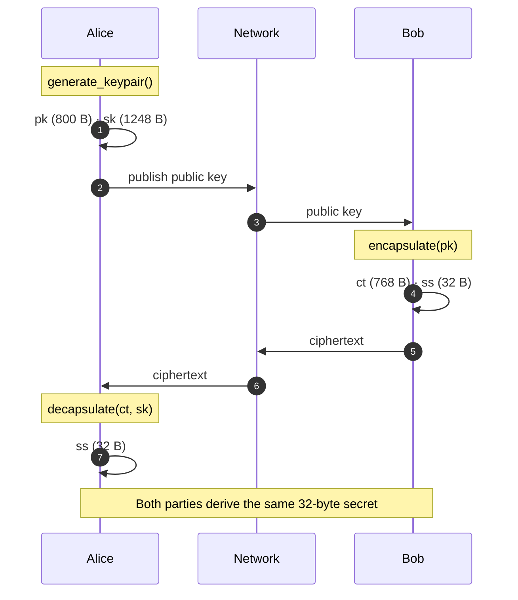

<p align="center">
  <a href="README.md">← Documentation</a>
  &nbsp;·&nbsp;
  <strong>Overview</strong>
  &nbsp;·&nbsp;
  <a href="getting-started.md">Quickstart →</a>
</p>

<h1 align="center">Overview</h1>

<p align="center">
  What VORTEX-256 is, why it exists, and how it fits in the post-quantum landscape
</p>

<br/>

## What is VORTEX-256?

**VORTEX-256** is a lattice-based **Key Encapsulation Mechanism (KEM)** invented
at Bajpai Labs. It lets two parties establish a shared 32-byte secret over an
insecure channel — the foundational operation behind post-quantum TLS, VPNs,
and encrypted messaging.

The cryptographic innovation is **Rotational Module Learning With Errors
(RotMLWE)**: instead of hiding secrets under a random module matrix (as ML-KEM
does), VORTEX hides a single secret under the **Frobenius orbit** of one ring
element.

```
Standard approach (ML-KEM):          VORTEX-256 approach (RotMLWE):

   A  (k×k matrix)                       a  (one element)
   ↓                                     ↓
   A·s + e                                 a₀=a, a₁=σ(a), a₂=σ²(a)…
                                           ↓
                                           aᵢ·s + eᵢ
```

<br/>

## Design goals

<table>
<thead>
<tr><th align="left">Goal</th><th align="left">How VORTEX achieves it</th></tr>
</thead>
<tbody>
<tr>
<td><strong>Novel security foundation</strong></td>
<td>New hardness assumption (RotMLWE) with a clean algebraic construction</td>
</tr>
<tr>
<td><strong>Wire-compatible footprint</strong></td>
<td>Same pk/ct sizes as Kyber-512 — 800 / 768 / 32 bytes</td>
</tr>
<tr>
<td><strong>Efficient key expansion</strong></td>
<td>1 XOF call + cheap permutations vs k² matrix expansion</td>
</tr>
<tr>
<td><strong>Accessible to developers</strong></td>
<td>Pure Python (zero deps) + optional C native backend + PEM support</td>
</tr>
<tr>
<td><strong>CCA-secure by construction</strong></td>
<td>Fujisaki–Okamoto transform with implicit rejection</td>
</tr>
</tbody>
</table>

<br/>

## Who is this for?

<table>
<thead>
<tr><th align="left">Audience</th><th align="left">Use case</th><th align="left">Start here</th></tr>
</thead>
<tbody>
<tr>
<td>Application developers</td>
<td>Post-quantum key exchange in apps, services, IoT</td>
<td><a href="getting-started.md">Quickstart</a> → <a href="guides-key-exchange.md">Integration guide</a></td>
</tr>
<tr>
<td>Security engineers</td>
<td>Threat modeling, key management, compliance review</td>
<td><a href="security.md">Security model</a></td>
</tr>
<tr>
<td>Cryptographers</td>
<td>Analyze RotMLWE assumption, parameter choices</td>
<td><a href="concepts.md">Concepts</a> → <a href="cryptography.md">Cryptography</a></td>
</tr>
<tr>
<td>Systems programmers</td>
<td>Embed in C/C++ services, firmware, HSMs</td>
<td><a href="guides-c-library.md">C library guide</a></td>
</tr>
<tr>
<td>Contributors</td>
<td>Extend the library, fix bugs, improve performance</td>
<td><a href="development.md">Development guide</a></td>
</tr>
</tbody>
</table>

<br/>

## How a key exchange works



The shared secret is never transmitted. Bob derives it during encapsulation;
Alice recovers the identical value during decapsulation.

<br/>

## Package surfaces

<table>
<thead>
<tr><th align="left">Surface</th><th align="left">Install</th><th align="left">Best for</th></tr>
</thead>
<tbody>
<tr>
<td><strong>Python</strong> (<code>vortex_pqc</code>)</td>
<td><code>pip install vortex-pqc</code></td>
<td>Applications, scripts, services, prototyping</td>
</tr>
<tr>
<td><strong>C library</strong> (<code>libvortex_pqc.a</code>)</td>
<td>Build from source</td>
<td>Embedded systems, native services, language bindings</td>
</tr>
<tr>
<td><strong>PEM encoding</strong></td>
<td>Included in Python package</td>
<td>Key files, config management, ops tooling</td>
</tr>
</tbody>
</table>

<br/>

## When to use VORTEX-256

### Good fit

- Post-quantum research and prototyping
- Education and benchmarking lattice KEM constructions
- Exploring alternatives to ML-KEM's matrix-based assumption
- Applications that need Kyber-compatible wire sizes with a different primitive

### Not recommended (yet)

- Production TLS without independent security audit
- Regulated environments requiring NIST-approved algorithms (use ML-KEM)
- Long-term archival keys where algorithm agility is unavailable

See [Comparison guide](comparison.md) and [Security model](security.md) for details.

<br/>

## Research preview status

VORTEX-256 is published as a **research preview** — similar to how major
organisations ship experimental APIs before general availability:

| Stage | Status |
|:------|:-------|
| Reference implementation | ✅ Python + C |
| Test suite | ✅ 26 Python + 3 C tests |
| Documentation | ✅ You are here |
| PyPI distribution | ✅ `vortex-pqc` |
| NIST standardisation | ❌ Not applicable |
| Independent cryptanalysis | ⏳ Ongoing community review welcome |

<br/>

## Next steps

<table>
<tr>
<td width="50%">

**Ready to code?**
→ [Quickstart](getting-started.md)

**Integrating into a service?**
→ [Key exchange guide](guides-key-exchange.md)

</td>
<td width="50%">

**Want the math?**
→ [Core concepts](concepts.md)

**Evaluating vs Kyber?**
→ [Comparison guide](comparison.md)

</td>
</tr>
</table>
