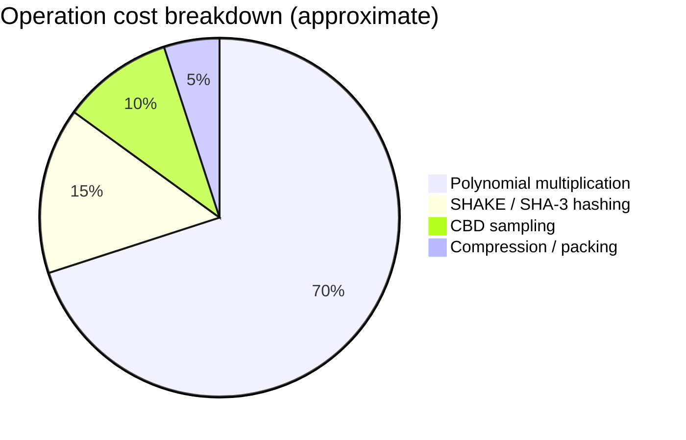

<p align="center">
  <a href="README.md">← Documentation</a>
  &nbsp;·&nbsp;
  <strong>Performance</strong>
  &nbsp;·&nbsp;
  <a href="guides-c-library.md">C library →</a>
</p>

<h1 align="center">Performance</h1>

<p align="center">
  Benchmarks, backend comparison, and optimisation guidance
</p>

<br/>

## Backends at a glance

<table>
<thead>
<tr>
<th align="left">Backend</th>
<th align="left">Implementation</th>
<th align="center">Relative speed</th>
<th align="left">When to use</th>
</tr>
</thead>
<tbody>
<tr>
<td><code>vortex-pqc-native</code></td>
<td>C extension (compiled)</td>
<td align="center">~10× faster</td>
<td>Production, benchmarks, services</td>
</tr>
<tr>
<td><code>vortex-pqc-pure-python</code></td>
<td>Python reference (schoolbook mul)</td>
<td align="center">Baseline</td>
<td>CI without compiler, education, correctness checks</td>
</tr>
</tbody>
</table>

<br/>

## Running benchmarks

```python
from vortex_pqc import benchmark_throughput, native_backend

print(f"Backend: {native_backend()}")
results = benchmark_throughput(operations=50)

for op, stats in results.items():
    ops = stats["mean_ops"]
    ci  = stats["confidence_interval"]
    print(f"{op:8s}  {ops:8,.0f} ops/s  (± {ci:,.0f})")
```

Example output (native, Apple Silicon — your numbers will vary):

```
Backend: vortex-pqc-native-aarch64
keygen      1,200 ops/s  (± 50)
encaps      1,100 ops/s  (± 45)
decaps      1,150 ops/s  (± 48)
```

<br/>

## Where time is spent



| Operation | Dominant cost | Notes |
|:----------|:-------------|:------|
| Keygen | 1× poly mul per rotation + XOF | 1 XOF call (vs 4 in Kyber-512) |
| Encaps | K poly muls + hashing | Fresh randomness each call |
| Decaps | K poly muls + re-encryption | FO check adds one full encaps path |

<br/>

## VORTEX vs Kyber-512 efficiency

| Metric | Kyber-512 | VORTEX-256 | Advantage |
|:-------|:----------|:-----------|:----------|
| Key expansion XOF calls | 4 | **1** | VORTEX |
| Frobenius rotations | N/A | K−1 permutations | VORTEX (free vs XOF) |
| Private key size | 1 632 B | **1 248 B** | VORTEX |
| Poly mul count (encaps) | Similar | Similar | Tie |
| NTT optimisation | Available | Planned | Kyber (today) |

<br/>

## Optimisation roadmap

<table>
<thead>
<tr><th align="left">Optimisation</th><th align="center">Status</th><th align="left">Expected gain</th></tr>
</thead>
<tbody>
<tr><td>Schoolbook poly mul (C)</td><td align="center">✅ Shipped</td><td>Baseline native</td></tr>
<tr><td>NTT-based poly mul</td><td align="center">🔜 Planned</td><td>5–10× on poly operations</td></tr>
<tr><td>AVX2 / NEON SIMD</td><td align="center">🔜 Planned</td><td>2–4× on NTT</td></tr>
<tr><td>ARM64 <code>-mcpu=native</code></td><td align="center">✅ Shipped</td><td>Platform-specific tuning</td></tr>
</tbody>
</table>

<br/>

## Tuning for your deployment

<details>
<summary><strong>Maximise throughput (servers)</strong></summary>

<br/>

```
✓  Install with C compiler present (native backend)
✓  Use pip install without --no-binary
✓  Pre-generate key pairs (keygen is amortised)
✓  Batch encapsulations if your protocol allows
```

</details>

<details>
<summary><strong>Minimise binary size (embedded)</strong></summary>

<br/>

```
✓  Link only libvortex_pqc.a (no Python)
✓  Strip symbols: cc ... -s
✓  Pre-provision keys offline (skip keygen on device)
```

</details>

<details>
<summary><strong>CI without a compiler</strong></summary>

<br/>

```
✓  Pure Python backend works everywhere
✓  All 26 tests pass without _native.so
✓  Slower but cryptographically identical
```

</details>

<br/>

## C benchmark

```bash
cd c
make lib
# Optional: build and run bench test if available
make -C c test
```

<br/>

<p align="center">
  <a href="guides-python.md">Python guide</a>
  &nbsp;·&nbsp;
  <a href="architecture.md">Architecture</a>
</p>
