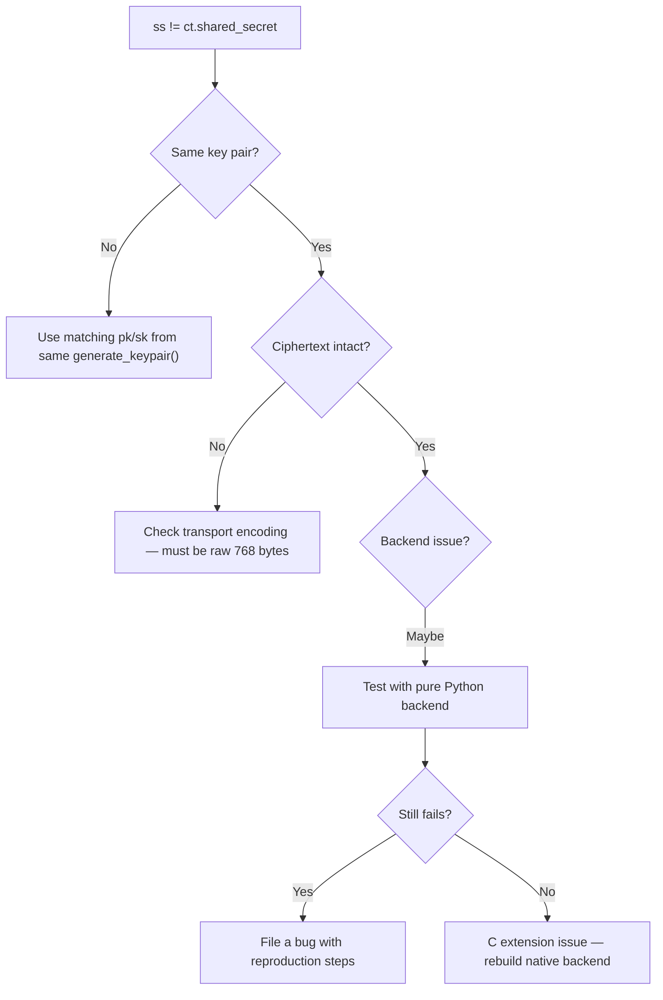

<p align="center">
  <a href="README.md">← Documentation</a>
  &nbsp;·&nbsp;
  <strong>Troubleshooting</strong>
  &nbsp;·&nbsp;
  <a href="faq.md">FAQ →</a>
</p>

<h1 align="center">Troubleshooting</h1>

<p align="center">
  Diagnose and fix common issues with VORTEX-256
</p>

<br/>

## Quick diagnostics

Run this in your environment:

```python
import vortex_pqc

print(f"version:  {vortex_pqc.__version__}")
print(f"backend:  {vortex_pqc.native_backend()}")
print(f"pk size:  {vortex_pqc.PUBLIC_KEY_BYTES}")
print(f"sk size:  {vortex_pqc.PRIVATE_KEY_BYTES}")
print(f"ct size:  {vortex_pqc.CIPHERTEXT_BYTES}")

kp = vortex_pqc.generate_keypair()
ct = vortex_pqc.encapsulate(kp.public_key)
ss = vortex_pqc.decapsulate(ct.data, kp.private_key)
print(f"round-trip: {'OK' if ss == ct.shared_secret else 'FAILED'}")
```

Expected:

```
version:  0.1.0
backend:  vortex-pqc-native-aarch64   (or vortex-pqc-pure-python)
pk size:  800
sk size:  1248
ct size:  768
round-trip: OK
```

<br/>

## Error reference

<table>
<thead>
<tr>
<th align="left">Error</th>
<th align="left">Cause</th>
<th align="left">Fix</th>
</tr>
</thead>
<tbody>
<tr>
<td><code>Invalid public key length: expected 800, got N</code></td>
<td>Wrong byte count passed to <code>encapsulate()</code></td>
<td>Ensure exactly 800 bytes. Check for truncation, encoding, or wrong key type.</td>
</tr>
<tr>
<td><code>Invalid ciphertext length: expected 768, got N</code></td>
<td>Wrong byte count passed to <code>decapsulate()</code></td>
<td>Ensure exactly 768 bytes. Verify transport framing doesn't corrupt payload.</td>
</tr>
<tr>
<td><code>Invalid private key length: expected 1248, got N</code></td>
<td>Wrong byte count passed to <code>decapsulate()</code></td>
<td>Ensure exactly 1248 bytes. Re-read PEM with correct <code>PEMKind.PRIVATE_KEY</code>.</td>
</tr>
<tr>
<td><code>invalid data length for PUBLIC KEY</code></td>
<td>PEM encode with wrong-sized bytes</td>
<td>Pass exactly 800 bytes to <code>encode_pem(PEMKind.PUBLIC_KEY, ...)</code></td>
</tr>
<tr>
<td><code>missing or invalid PEM block</code></td>
<td>Malformed PEM file or wrong kind</td>
<td>Check BEGIN/END labels match <code>VORTEX256</code> format. See <a href="pem-format.md">PEM spec</a>.</td>
</tr>
<tr>
<td><code>invalid Base64 payload</code></td>
<td>Corrupted PEM body</td>
<td>Re-encode from raw bytes. Check for line wrapping issues.</td>
</tr>
<tr>
<td><code>SecurityError: Decapsulation failed</code></td>
<td>Native backend integrity check (rare)</td>
<td>Verify ciphertext and private key are from the same key pair.</td>
</tr>
<tr>
<td>Shared secrets don't match</td>
<td>Key mismatch or tampered ciphertext</td>
<td>See <a href="#shared-secrets-dont-match">debugging guide below</a></td>
</tr>
<tr>
<td><code>ModuleNotFoundError: vortex_pqc</code></td>
<td>Package not installed</td>
<td><code>pip install vortex-pqc</code></td>
</tr>
<tr>
<td>Native backend not available</td>
<td>C extension didn't compile</td>
<td>Install C compiler and reinstall: <code>pip install -e . --force-reinstall</code></td>
</tr>
</tbody>
</table>

<br/>

## Shared secrets don't match



### Checklist

```
□  pk and sk came from the same generate_keypair() call
□  ct.data is exactly 768 bytes (not hex-encoded, not base64 on wire)
□  No byte corruption during network transfer
□  Not comparing against a different encapsulation's shared_secret
□  Using decapsulate(ct.data, sk) not decapsulate(ct, sk) — ct is a Ciphertext tuple
```

<br/>

## Backend issues

### Force pure Python for debugging

```bash
mv src/vortex_pqc/_native*.so /tmp/ 2>/dev/null
python -m pytest src/tests/ -v
```

If tests pass in pure Python but fail in native → C extension bug. Rebuild:

```bash
pip install -e . --force-reinstall --no-deps
```

### Verify C library independently

```bash
make -C c clean test
```

<br/>

## Installation issues

<details>
<summary><strong>pip install fails on C extension (non-fatal)</strong></summary>

<br/>

The package installs without the native extension. You'll get
`vortex-pqc-pure-python` backend. To fix:

```bash
# macOS
xcode-select --install

# Ubuntu/Debian
sudo apt install build-essential python3-dev

pip install -e . --force-reinstall
```

</details>

<details>
<summary><strong>PEP 668 externally-managed-environment</strong></summary>

<br/>

```bash
python3 -m venv .venv
source .venv/bin/activate
pip install vortex-pqc
```

</details>

<br/>

## Getting help

| Channel | When |
|:--------|:-----|
| [FAQ](faq.md) | Common questions |
| [GitHub Issues](https://github.com/bajpai-labs/vortex-pqc/issues) | Bugs, feature requests |
| hello@bajpailabs.com | Security vulnerabilities (private) |

When filing a bug, include:

```
- vortex_pqc.__version__
- vortex_pqc.native_backend()
- Python version and OS
- Minimal reproduction script
- Full error message and traceback
```

<br/>

<p align="center">
  <a href="faq.md">FAQ</a>
  &nbsp;·&nbsp;
  <a href="getting-started.md">Quickstart</a>
</p>
